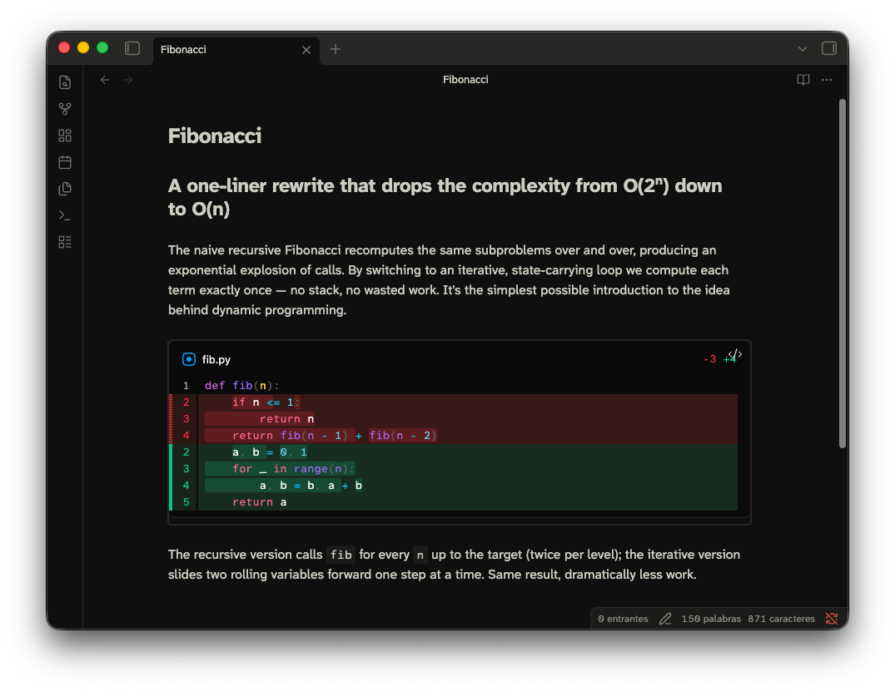
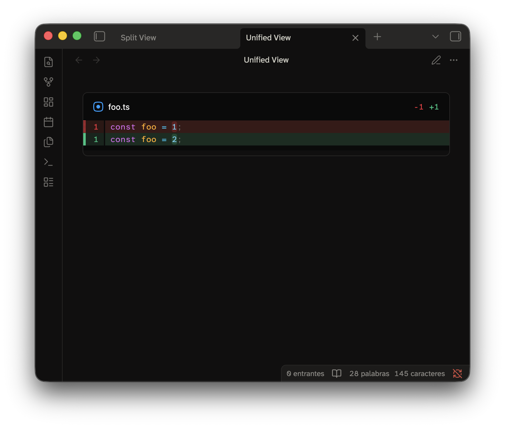
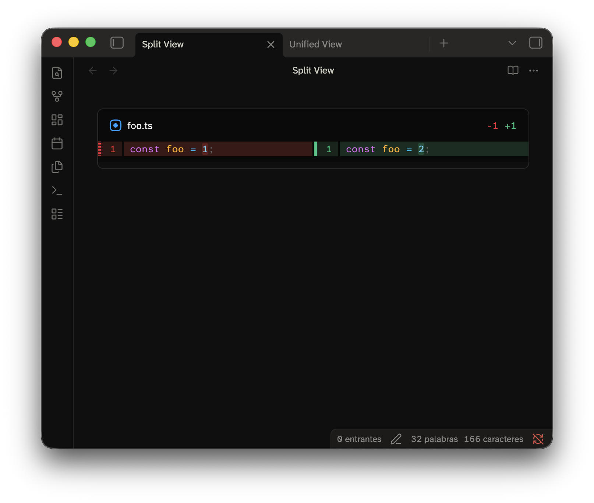

# Code Diff — Obsidian plugin



Show code diffs inside your notes. This plugin uses
[`@pierre/diffs`](https://diffs.com) as the (beautiful) rendering engine.
Please read the section about [Security & Privacy](#security-%26-privacy) before start using this extension.

> ⚠️ Status: early!
> Embedded diffs and local Git repositories work. Remote repositories and caching are not implemented yet.

## Syntax

A diff lives in a fenced code block. The block is tagged `code-diff`.

<table>
<tr>
<td>

````markdown
```code-diff
diff --git a/foo.ts b/foo.ts
index 1234567..89abcde 100644
--- a/foo.ts
+++ b/foo.ts
@@ -1 +1 @@
-const foo = 1;
+const foo = 2;
```
````

</td>
<td>

</td>
</tr>
</table>


The input format is standard `git diff` output.

You can add a YAML frontmatter to the block!
This is how you can edit some configurations from the renderer, this example draws the diff in split view.

<table>
<tr>
<td>

````markdown
```code-diff
---
view: split
---

diff --git a/foo.ts b/foo.ts
index 1234567..89abcde 100644
--- a/foo.ts
+++ b/foo.ts
@@ -1 +1 @@
-const foo = 1;
+const foo = 2;
```
````

</td>
<td>

</td>
</tr>
</table>

### A diff generated from a local repository

Referencing a directory is another way to build a code-diff block. This kind of block use `git`,
so they only run on the Desktop app. They won't work on mobile and in browsers!

This one shows the changes between two different branches:

````markdown
```code-diff
repo: ../my-project
from: main
to: feature/foo
```
````

You can even point to a single commit or filter which files to include.

````markdown
```code-diff
repo: ../my-project
commit: abc123
paths: [package.json]
```
````

## Options

Here's a list of every setting allowed in the frontmatter.

| Option | Values | Default | Meaning |
|---|---|---|---|
| `repo` | path | — | The path of a local repository. Relative paths resolve from the vault folder (configurable). The plugin expands `~`. |
| `from` | revision | `HEAD` | The left side of the diff. Use a branch, tag, sha, or any Git revision. |
| `to` | revision | `HEAD` | The right side of the diff. |
| `commit` | revision | — | Shows the changes that one commit introduced. Do not combine it with `from` or `to`. |
| `paths` | string or list | — | Restrict the diff to these paths. |
| `context` | integer | Git default | The lines of context that you ask Git for. |
| `view` | `unified`, `split` | `unified` | Layout of the diff. `inline` and `side-by-side` are accepted aliases. |
| `theme` | `auto`, `light`, `dark` | `auto` | With `auto`, the theme follows Obsidian and changes with it. |
| `lineNumbers` | boolean | `true` | Show line numbers. |
| `wrap` | boolean | `false` | Wrap long lines instead of scrolling. |
| `fileHeader` | boolean | `true` | Show the header of each file. |
| `highlight` | `word`, `char`, `none` | `word` | Highlight the changed part inside a line. |
| `lightTheme` / `darkTheme` | bundled theme name | `pierre-light` / `pierre-dark` | Override the syntax theme. |
| `fontFamily` | CSS `font-family` | Obsidian's monospace font | The font for the diff content. |
| `maxHeight` | CSS length or `none` | `60vh` | The maximum height of the scroll region for the diff. Use `none` to let it grow with the note. |

You can set defaults for the presentation options in the plugin settings.
A block always wins over the setting.

## Security & privacy

This plugin is flagged as **shell execution** because generating a diff
from a repository means running `git`.

- **What runs.** Only the `git` executable already installed on your machine,
  and only these read-only subcommands:
  - `git rev-parse` to resolve revisions.
  - `git diff` / `git show` to produce the patch.
  The plugin **never** writes to a repository, never stages, commits, pushes or fetches.
- **How it runs.** Git is spawned directly with an argument list:
  - `execFile`, so nothing in a note can be interpreted as shell syntax.
  - External diff drivers and pagers configured in a repository are explicitly disabled using `--no-ext-diff` and `--no-pager`.
  - Git will never prompt for credentials.
  - Every invocation has a 30-second timeout and a bounded output size.
- **When it runs.** Only when a `code-diff` block sets `repo:`. Blocks with a
  pasted diff don't need to touch `git`, the job is already done!
- **What it can read.** A `repo:` block can point at any local repository your
  user account can read, including ones **outside the vault**. Please, treat `repo:` blocks
  in notes you did not write yourself with the same care as any other content
  that references files on your machine.
- **Network & telemetry.** Nada. The plugin makes no network requests and
  collects no data. Remote repository URLs are currently recognised but rejected.

## Install for development

```bash
npm install
npm run build
node scripts/install.mjs "/path/to/Vault"
```

Then reload Obsidian. Enable **Code Diff** under *Settings → Community plugins*.

During development, run `npm run dev`. It rebuilds the plugin on change.
Then run the install script again, or just symlink the folder
