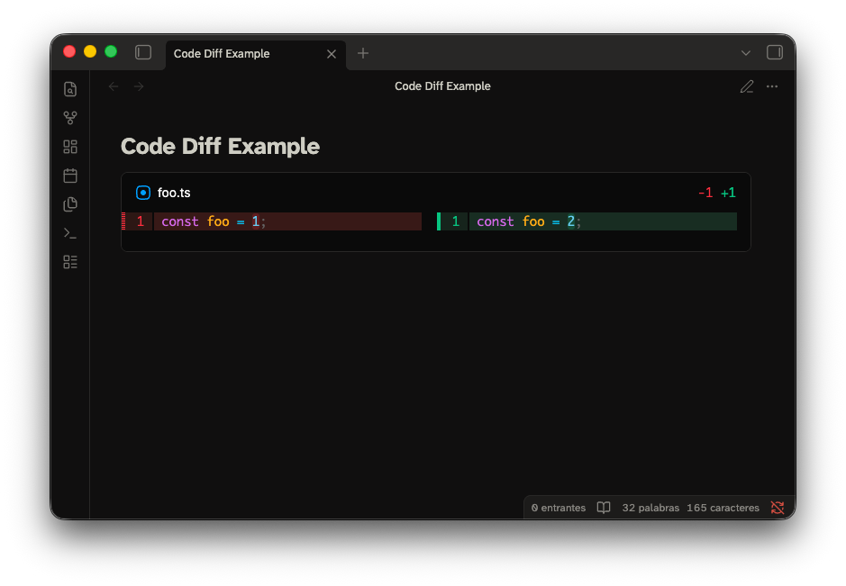

# Code Diff — Obsidian plugin



Render code diffs in the middle of your notes, using
[`@pierre/diffs`](https://diffs.com) as the rendering engine.

> Status: early. Embedded diffs and local Git repositories work. Remote
> repositories and caching are not implemented yet — see
> [HANDOVER.md](./HANDOVER.md).

## Install for development

```bash
npm install
npm run build
node scripts/install.mjs "/path/to/Vault"
```

Then reload Obsidian and enable **Code Diff** under *Settings → Community plugins*.

For iterating, `npm run dev` rebuilds on change; re-run the install script (or
symlink the folder) to pick the build up.

Desktop only: generating diffs shells out to `git`.

## Syntax

Diffs live in a fenced block tagged `code-diff`, with optional YAML frontmatter.

### A diff pasted into the note

````markdown
```code-diff
---
view: split
---

diff --git a/foo.ts b/foo.ts
index 1234567..89abcde 100644
--- a/foo.ts
+++ b/foo.ts
@@ -1 +1 @@
-const foo = 1;
+const foo = 2;
```
````

Standard `git diff` output is the input format — no rewriting into a custom
before/after syntax. Plain unified diffs (`---`/`+++`/`@@`) work too.

### A diff generated from a local repository

````markdown
```code-diff
repo: ../my-project
from: main
to: feature/foo
```
````

### The changes introduced by one commit

````markdown
```code-diff
repo: ../my-project
commit: abc123
```
````

## Options

| Option | Values | Default | Meaning |
|---|---|---|---|
| `repo` | path | — | Local repository. Relative paths resolve from the vault folder (configurable). `~` is expanded. |
| `from` | revision | `HEAD` | Left-hand side. Branch, tag, sha, or any Git revision. |
| `to` | revision | `HEAD` | Right-hand side. |
| `commit` | revision | — | Shorthand for the changes that commit introduced. Cannot be combined with `from`/`to`. |
| `paths` | string or list | — | Restrict the diff to these paths. |
| `context` | integer | Git default | Lines of context to ask Git for. |
| `view` | `unified`, `split` | `unified` | Layout. `inline`/`side-by-side` are accepted aliases. |
| `theme` | `auto`, `light`, `dark` | `auto` | `auto` follows Obsidian's appearance and reacts to changes. |
| `lineNumbers` | boolean | `true` | Show line numbers. |
| `wrap` | boolean | `false` | Wrap long lines instead of scrolling. |
| `fileHeader` | boolean | `true` | Show the per-file header. |
| `highlight` | `word`, `char`, `none` | `word` | Intra-line change highlighting. |
| `lightTheme` / `darkTheme` | bundled theme name | `pierre-light` / `pierre-dark` | Override the syntax theme. See [Syntax highlighting](#syntax-highlighting). |
| `fontFamily` | CSS `font-family` | Obsidian's monospace font | Font for the diff content. |
| `maxHeight` | CSS length or `none` | `60vh` | Cap the height of the diff's scroll region. Use `none` to let it grow with the note. |

Defaults for the presentation options can be set in the plugin settings; a block
always wins over the setting.

## Syntax highlighting

Shiki ships 260 TextMate grammars and 75 themes, and an Obsidian plugin is a
single bundled `main.js` — so shipping all of them would mean an 11 MB plugin,
loaded on every app start. This one bundles a subset instead: 74 languages and
Pierre's 10 themes, which is 3.8 MB.

- A file whose language is not bundled still renders. It comes out uncoloured,
  and the block adds a warning naming the language.
- The available names are `pierre-light` / `pierre-dark` plus their `-soft`, `-vibrant`,
  `-protanopia-deuteranopia` and `-tritanopia` variants.

## States

The block never fails silently. It shows `Loading diff…` while working, then one
of: the diff, `No changes`, or an error headline such as `Diff not found`,
`Repository not found`, `Invalid Git repository`, `Git is not available`, or
`Invalid diff`. Command output and other diagnostics are tucked into a
collapsed **Details** section rather than shown as the primary UI.

## Development

```bash
npm run typecheck
npm test
npm run build
```
